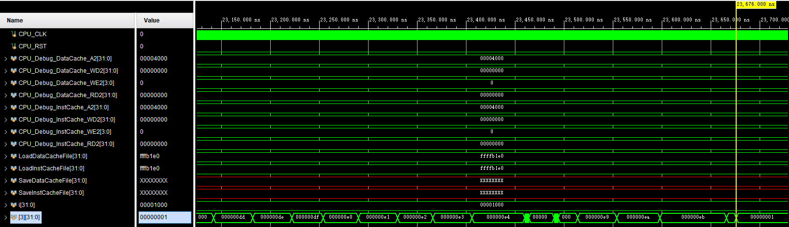
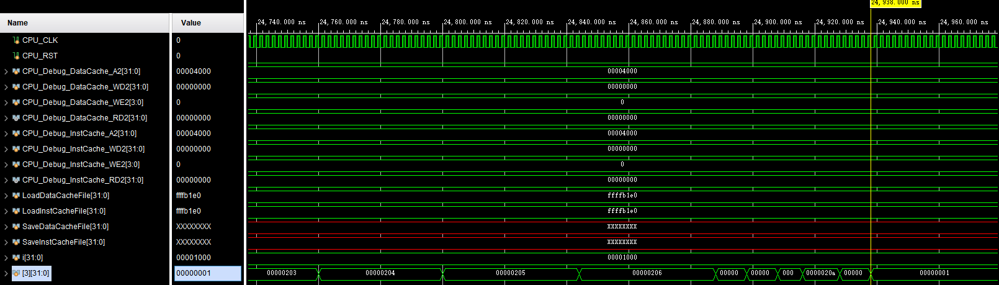
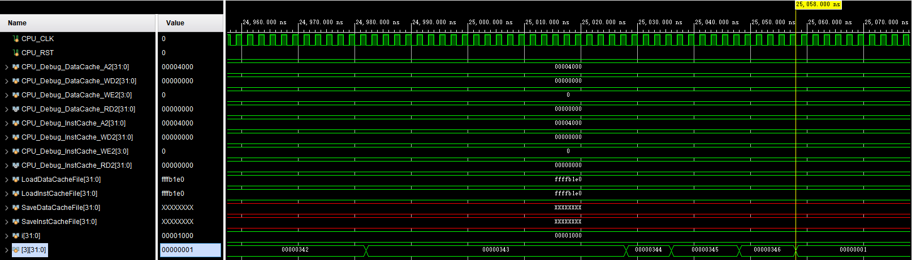
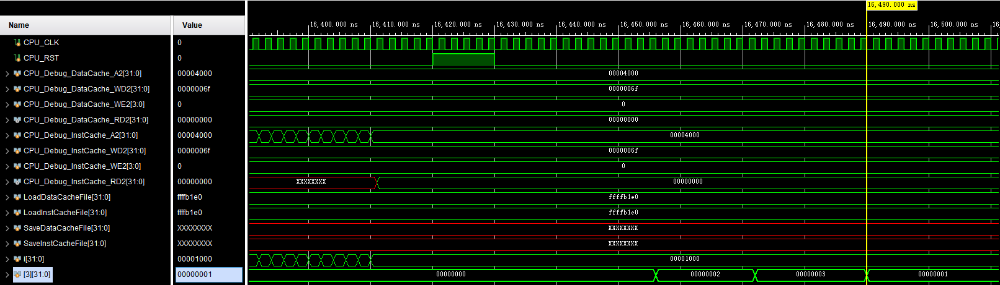

# 体系结构_Lab2

PB19000015 贾欣宇

[toc]

## 实验目的

1. 掌握五级流水线 CPU 的设计方法；
2. 熟悉 RISC-V 的指令集和数据通路，了解其设计背后的思想；
3. 进一步提高使用 Verilog 编码和调试的能力，学会使用仿真（Simulation）调试。

## 实验内容

### 阶段一

#### 阶段目标

1. 实现`SLLI`、`SRLI`、`SRAI`、`ADD`、`SUB`、`SLL`、`SLT`、`SLTU`、`XOR`、`SRL`、`SRA`、`OR`、`AND`、`ADDI`、`SLTI`、`SLTIU`、`XORI`、`ORI`、`ANDI`、`LUI`、`AUIPC`指令；
2. 设计合适的测试用汇编代码生成`.inst`和`.data`文件，用于初始化指令和数据的Block Memory；
3. 测试例（汇编和对应的.inst .data）可以用其他同学提供的，但是需要自己知道对应的指令逻辑，需要能清楚的向助教表达这个测试例如何验证 CPU 功能正确，即正确运行后寄存器值应该是多少
4. 在不考虑数据相关的情况下，CPU 执行指令后各寄存器值符合预期。

#### 实验过程

1. 完成`Harzard.v`等的初始化设置；
2. 完成`ALU.v`、`ControllerDecoder.v`、`ImmExtend.v`和`NPC_Generator.v`的设计。

#### 运行结果

实验过程中阶段一与阶段二同步完成，未进行阶段一的专用测试，故略去该阶段运行结果。

### 阶段二

#### 阶段目标

1. 继续实现`JALR`、`LB`、`LH`、`LW`、`LBU`、`LHU`、`SB`、`SH`、`SW`、`BEQ`、`BNE`、`BLT`、`BLTU`、`BGE`、`BGEU`、`JAL`指令。
2. 运行提供的测试样例，在考虑数据相关的情况下，CPU 执行指令后各寄存器值符合预期。

#### 实验过程

1. 完成`BranchDecision.v`、`DataExtend.v`和`Harzard.v`的设计，扩充`ControllerDecoder.v`和`NPC_Generator.v`以适配新的指令。
2. 运行测试样例，根据运行结果评估 CPU 的功能实现是否符合预期。

#### 运行结果

测试样例`1testAll`、`2testAll`、`3testAll`用于测试阶段一和阶段二设计的指令及数据相关的处理。对于任意一个测试样例，CPU 开始执行后 3 号寄存器的值会从 2 一直累增，该数字正在进行第多少项测试，执行结束后 3 号寄存器值变为 1。

*   1testAll

*   2testAll

*   3testAll

三个测试样例的运行结果均符合预期。

### 阶段三

#### 阶段目标

1. 完成 CSR 数据通路设计
2. 完成`CSRRW`、`CSRRS`、`CSRRC`、`CSRRWI`、`CSRRSI`、`CSRRCI`指令。
3. 运行提供的测试样例，CPU 执行指令后各寄存器值符合预期。

#### 实验过程

1. 完成`CSE_EX.v`、`CSR_Regfile.v`的设计，扩充`ALU.v`和`ControllerDecoder.v`以适配 CSR 指令。
2. 运行测试样例，根据运行结果评估 CPU 的功能实现是否符合预期。

#### 运行结果

测试样例`CSRtest`用于测试阶段三设计的指令的处理。对于任意一个测试样例，CPU 开始执行后 3 号寄存器的值会从 2 一直累增，该数字正在进行第多少项测试，执行结束后 3 号寄存器值变为 1。

测试样例的运行结果符合预期。

## 实验总结

### 遇到的问题

1. 问题：ALU 操作数经过多选器后变为`32'hzzzz_zzzz`。

   解决方案：设置`CSR_EX`模块的初始化状态，避免干扰。

2. 问题：S 类指令写入`DataCache`的数据不正确。

   解决方案：修改`ControllerDecoder`模块中 S 类指令的`cache_write_en`信号为`4'b1111`。

4. 问题：CSR 的读写干扰问题。

   解决方案：CSR 寄存器写操作改在时钟上升沿进行，实现读优先。

### 实验收获

在本次实验中，完成了五级流水线 CPU 的实现，加深了对 RSIC-V 架构理解，体会了 RSIC-V 指令的巧妙之处。实验中涉及 CSR 的具体实现，加深了对 CSR 体系的理解。

### 实验用时

本次实验用时约5小时，包括编写 Verilog 代码（约4小时）、撰写文档（约1小时）。

## 改进意见

希望阶段一也提供测试样例。

