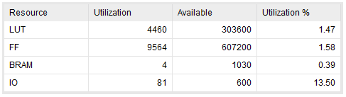
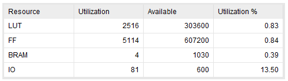
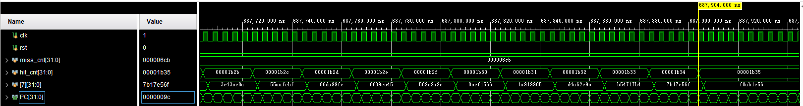
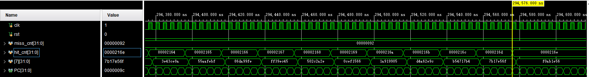

# 体系结构_Lab3

PB19000015 贾欣宇

[toc]

## 实验目的

1. 权衡cache size增大带来的命中率提升收益和存储资源电路面积的开销；
2. 权衡选择合适的组相连度；
3. 体会使用复杂电路实现复杂替换策略带来的收益和简单替换策略的优势；
4. 理解写回法的优劣.

## 实验内容

### 替换策略实现

#### FIFO

FIFO 策略的替换规则为每次换出最早存入的块. 对每个组维护一个循环链表（事实上只需维护一个指针`fifo_r`，它始终指向该组中最早存入的块），每次换出指针指向的块.

```verilog
if(swap_strategy == `FIFO) begin
    out_way = fifo_r[set_addr];
end
```

该指针初始化为 0 . 每次存入新块时都需要更新`fifo_r`使其指向新的最早存入的块（即循环链表中的下一块）.

```verilog
if(fifo_r[set_addr] == WAY_CNT - 1)
    fifo_r[set_addr] <= 0;
else
    fifo_r[set_addr] <= fifo_r[set_addr] + 1;
```

#### LRU

LRU 策略的替换规则为每次换出最近使用时间最早的块. 对每个组维护一个 LRU 记录表，LRU 记录值越小的块最近使用的时间越早，最近使用时间最早的块记录值为 0，而最近使用时间最晚的块记录值为 `WAY_CNT-1`. 每次换出 LRU 记录值为 0 的块.

```verilog
if(swap_strategy == `LRU) begin
    for(integer i = 0; i < WAY_CNT; i++) begin
        if(lru_r[set_addr][i] == 0) begin
            out_way = i;
            break;
        end
    end
end
```

LRU 记录表初始化为每一块对应的下标. 每次更新数据或存入新块时都需要更新记录表使其保持性质.

```verilog
for(integer i = 0; i < WAY_CNT; i++) begin
    if(lru_r[set_addr][i] > lru_r[set_addr][hit_way]) begin
        lru_r[set_addr][i] <= lru_r[set_addr][i] - 1;
    end
end
lru_r[set_addr][hit_way] <= WAY_CNT - 1;
```

```verilog
for(integer i = 0; i < WAY_CNT; i++) begin
    if(lru_r[set_addr][i] > lru_r[set_addr][out_way]) begin
        lru_r[set_addr][i] <= lru_r[set_addr][i] - 1;
    end
end
lru_r[set_addr][out_way] <= WAY_CNT - 1;
```

### Cache 资源消耗评估

修改 Cache 的参数（组数、组相连度、块大小等）进行综合得到资源占用报告，其中 LUT 和 FF 两个参数的使用量代表 Cache 所占用电路的资源量，多次修改参数得到下表：

| 组数 | 组相联度 | 块大小 | LUT  | FF    |
| ---- | -------- | ------ | ---- | ----- |
| 8    | 4        | 8      | 4460 | 9564  |
| 8    | 4        | 4      | 2516 | 5114  |
| 8    | 4        | 16     | 9536 | 18498 |
| 8    | 2        | 8      | 2112 | 5231  |
| 8    | 8        | 8      | 7825 | 18445 |
| 4    | 4        | 8      | 4261 | 5271  |
| 16   | 4        | 8      | 7324 | 18116 |

由于测试次数很多，选取前两次测试的结果截图如下：





由评估结果可知：组数、组相联度和块的大小都会显著影响 Cache 的资源消耗.

### Cache 性能评估

权衡资源消耗与性能，取组数为 8、块大小为 8，在规模为 256 的快速排序和规模为 16*16 的矩阵乘法上分别对 FIFO 和 LRU 两种策略和不同的组相联度进行测试，结果如下表：

| 算法     | 策略 | 组相联度 | 未命中 | 命中 | 命中率 | 周期数 |
| -------- | ---- | -------- | ------ | ---- | ------ | ------ |
| 矩阵乘法 | FIFO | 4        | 1739   | 6965 | 80.02% | 171974 |
| 矩阵乘法 | FIFO | 8        | 146    | 8558 | 98.32% | 73642  |
| 矩阵乘法 | LRU  | 4        | 2050   | 6654 | 76.45% | 176980 |
| 矩阵乘法 | LRU  | 8        | 113    | 8591 | 98.70% | 71342  |
| 快速排序 | FIFO | 4        | 89     | 6736 | 98.70% | 45380  |
| 快速排序 | FIFO | 8        | 42     | 6783 | 99.38% | 40243  |
| 快速排序 | LRU  | 4        | 104    | 6721 | 98.48% | 46791  |
| 快速排序 | LRU  | 8        | 42     | 6783 | 99.38% | 40243  |

由于测试次数很多，选取前两次测试的结果截图如下：





由测试结果可知：

1.   对于矩阵乘法，在组相联度较高时 LRU 优于 FIFO，组相联度较低时 FIFO 优于 LRU；
2.   对于快速排序，在组相联度较高时 LRU 与 FIFO 的性能几乎相同，组相联度较低时 FIFO 优于 LRU；
3.   增加组相联度能显著提升 Cache 的命中率，提高运行性能；
4.   权衡性能和资源消耗，对于矩阵乘法，应选择组相联度为 8 的 LRU 策略 Cache；对于快速排序，选择组相联度为 4 的 FIFO 策略 Cache 即可.

## 实验总结

本次实验中完成了组相联 Cache 的设计，实现了 FIFO 和 LRU 两种替换策略，并通过测试比较了二者的优劣，加深了对 Cache 的理解.

