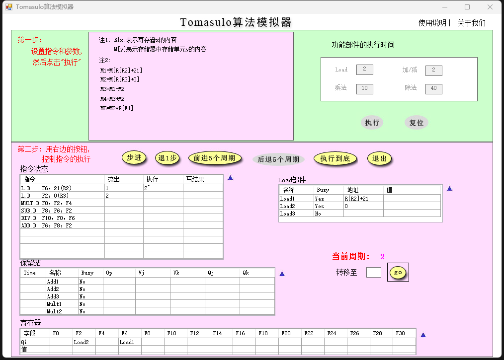
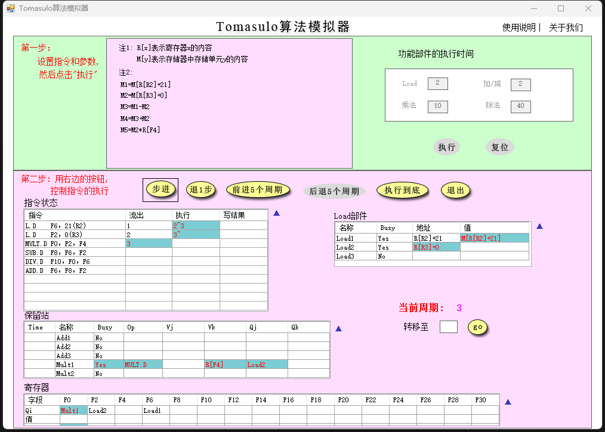
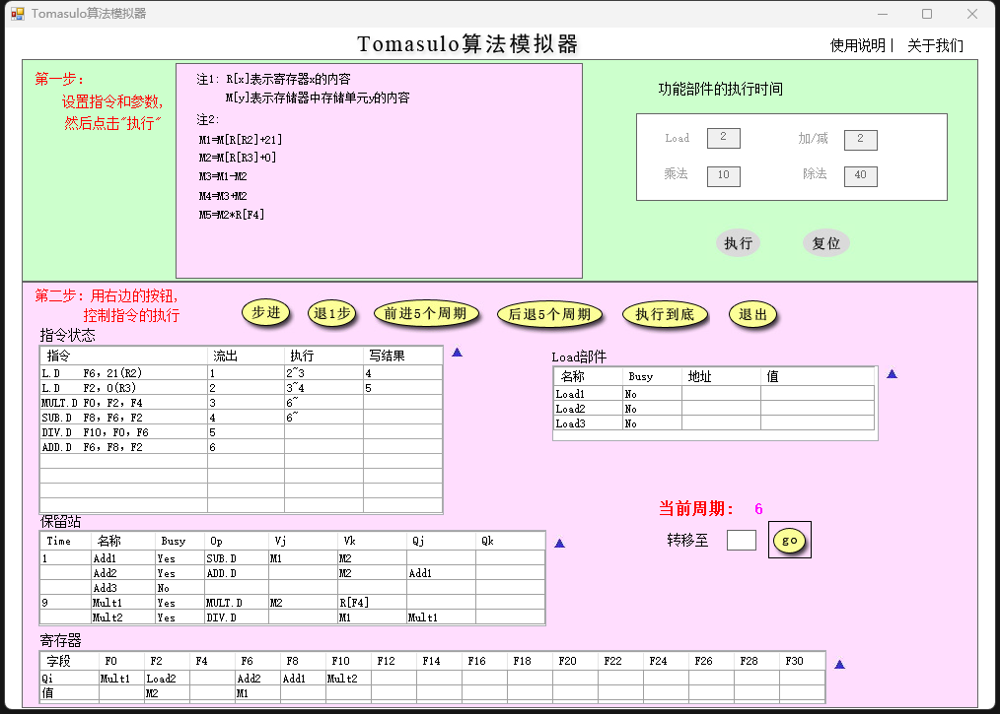
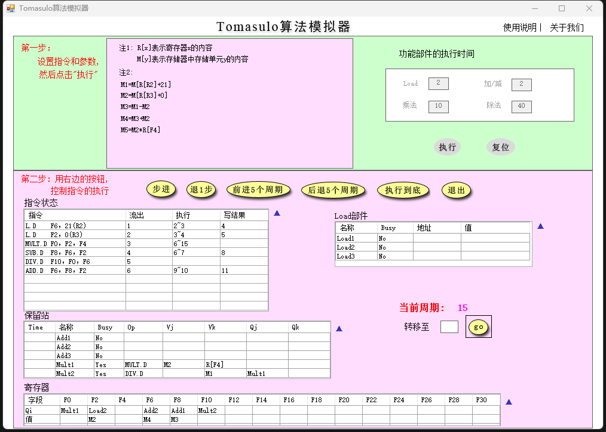
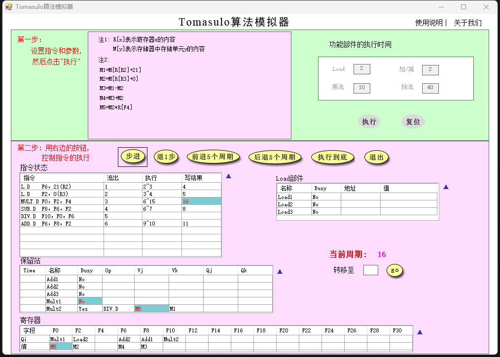
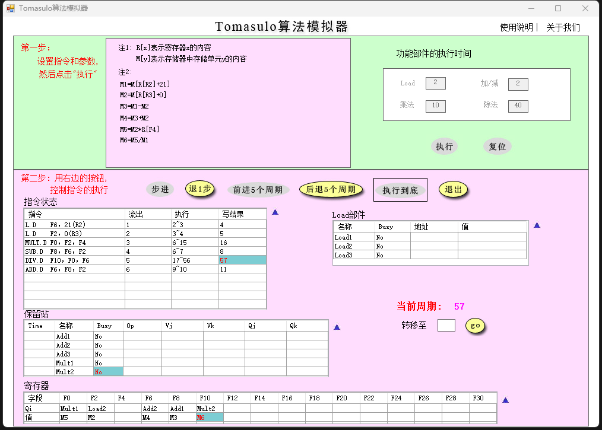
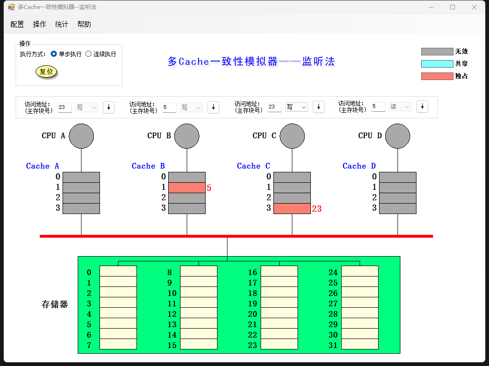
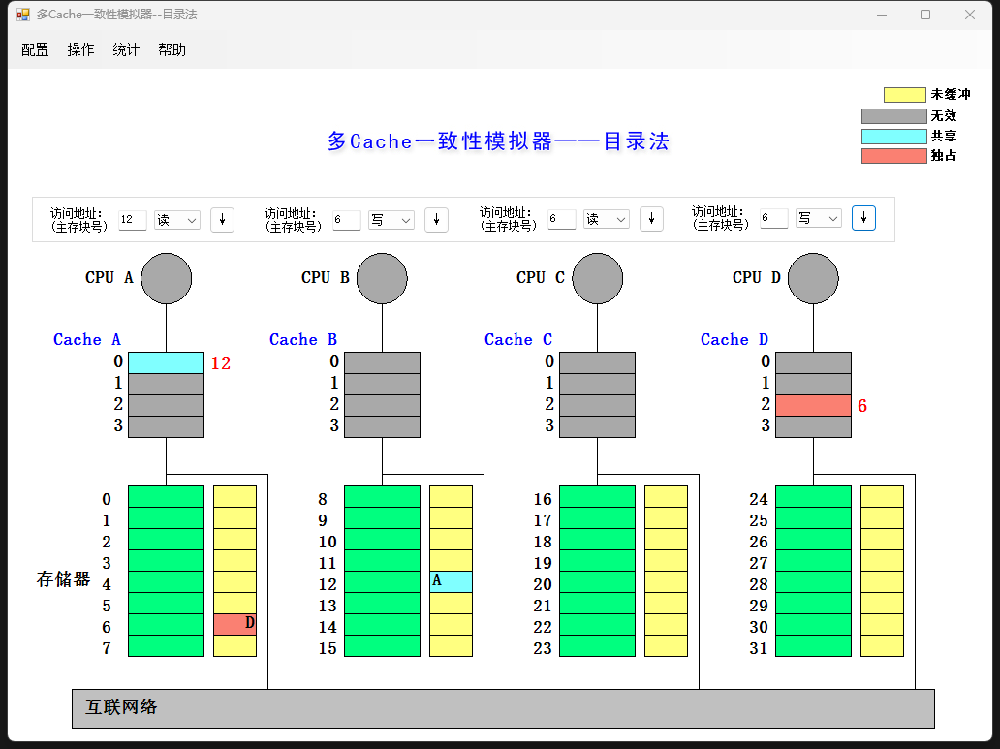

# CALab6 – Tomasulo 和 cache 一致性

PB19000015 贾欣宇

[toc]

## 一、Tomasulo 算法模拟器

### 1. 分别截图当前周期 2 和当前周期 3，简要说明 load 部件做了什么改动

周期 2：占用 Load2，Busy 置位，R2 就绪，将地址保存在 Load1 地址寄存器；

周期 3：Load1 将从寄存器读取的值保存在 Load1 部件寄存器，R3 就绪，将地址保存在 Load2 地址寄存器。

### 2. 截图 MUL.D 刚开始执行时系统状态，并说明该周期相比上一周期整个系统发生了哪些改动（指令状态、保留站、寄存器和 Load 部件）

*   发射第六条指令，第三条和第四条指令进入执行状态；
*   新发射的 ADD.D 指令占用 Add2 保留站，进入执行的指令 MUL.D 和 SUB.D 开始执行，时间开始倒计时；
*   新发射的 ADD.D 指令等待 F8 寄存器。

### 3. 简要说明是什么相关导致 MUL.D 流出后没有立即执行

源操作数 F2 未写回，直到第 5 周期 M2 写入后才就绪。

### 4. 分别截图 15 周期和 16 周期的系统状态，并分析系统发生了哪些变化

周期 15：指令 ADD.D 和指令 SUB.D 执行完毕，结果写回，释放保留站和寄存器；

周期 16：指令 MUL.D 结果写回，释放保留站 CBD，将结果广播到寄存器和指令 DIV.D 对应的保留站。

### 5. 回答所有指令刚刚执行完毕时是第多少周期，同时截图（最后一条指令写 CBD 时认为指令流执行结束）

第 57 周期。

## 二、多 cache 一致性算法 – 监听法

###1. 利用模拟器进行下述操作，并填写下表

| 所进行的访问    | 是否发生了替换     | 是否发生了写回     | 监听协议进行的操作与块状态改变                               |
| :-------------- | ------------------ | ------------------ | ------------------------------------------------------------ |
| CPUA 读第 5 块  | 替换 CacheA 的块 1 | 否                 | CacheA 发射 ReadMiss 存储器传输第 5 块到 CacheA CacheA 的块 1 从状态 I 转为 S |
| CPUB 读第 5 块  | 替换 CacheB 的块 1 | 否                 | CacheB 发射 ReadMiss 存储器传输第 5 块到 CacheB CacheB 的块 1 从状态 I 转为 S |
| CPUC 读第 5 块  | 替换 CacheC 的块 1 | 否                 | CacheC 发射 ReadMiss 存储器传输第 5 块到 CacheC CacheA 的块 1 从状态 I 转为 S |
| CPUB 写第 5 块  | 否                 | 否                 | CacheB 发射 Invalidate CacheA 的块 1 从状态 S 转为 I CacheC 的块 1 从状态 S 转为 I CacheB 的块 1 从状态 S 转为 M |
| CPUD 读第 5 块  | 替换 CacheD 的块 1 | CacheB 的块 1 写回 | CacheD 发射 ReadMiss CacheB 写回第 5 块 存储器传输第 5 块到 CacheD CacheB 的块 1 从状态 M 转为 S CacheD 的块 1 从状态 I 转为 S |
| CPUB 写第 21 块 | 替换 CacheB 的块 1 | 否                 | CacheB 发射 WriteMiss 存储器传输第 21 块到 CacheB CacheB 的块 1 从状态 S 转为 M |
| CPUA 写第 23 块 | 替换 CacheA 的块 3 | 否                 | CacheA 发射 WriteMiss 存储器传输第 23 块到 CacheA CacheA 的块 3 从状态 S 转为 M |
| CPUC 写第 23 块 | 替换 CacheC 的块 3 | CacheA 的块 3 写回 | CacheC 发射 WriteMiss CacheA 写回第 23 块 存储器传输第 23 块到 CacheC CacheA 的块 3 从状态 M 转为 I CacheC 的块 3 从状态 I 转为 M |
| CPUB 读第 29 块 | 替换 CacheB 的块 1 | CacheB 的块 1 写回 | CacheB 写回第 21 块 CacheB 发射 ReadMiss 存储器传输第 29 块到 CacheB CacheB 的块 1 从状态 M 转为 S |
| CPUB 写第 5 块  | 替换 CacheB 的块 1 | 否                 | CacheB 发射 WriteMiss 存储器传输第 5 块到 CacheB CacheB 的块 1 从状态 S 转为 M CacheD 的块 1 从状态 S 转为 I |

### 2. 截图展示执行完以上操作后整个 cache 系统的状态

## 三、多 cache 一致性算法 – 目录法

### 1. 利用模拟器进行下述操作，并填写下表

| 所进行的访问    | 监听协议进行的操作                                           | 块状态改变                                                   |
| --------------- | ------------------------------------------------------------ | ------------------------------------------------------------ |
| CPUA 读第 6 块  | CacheA 发送 ReadMiss 到 MemoryA MemoryA 传输第 6 块到 CacheA CacheA 的块 2 从状态 I 转为 S | MemoryA 的块 6： 状态：U -> S Presence bits：0000 -> 0001 共享集合：{A} |
| CPUB 读第 6 块  | CacheB 发送 ReadMiss 到 MemoryA MemoryA 传输第 6 块到 CacheB CacheB 的块 2 从状态 I 转为 S | MemoryA 的块 6： Presence bits：0001 -> 0011 共享集合：{A, B} |
| CPUD 读第 6 块  | CacheD 发送 ReadMiss 到 MemoryA MemoryA 传输第 6 块到 CacheD CacheD 的块 2 从状态 I 转为 S | MemoryA 的块 6： Presence bits: 0011 -> 1011 共享集合：{A, B, D} |
| CPUB 写第 6 块  | CacheB 发送 WriteHit 到 MemoryA MemoryA 发送 Invalidate(6) 到CacheA CacheA 的块 2 从状态 S 转为 I MemoryA 发送 Invalidate(6) 到到 CacheD CacheD 的块 2 从状态 S 转为 I CacheB 的块 2 从状态 S 转为 M | MemoryA 的块 6： 状态：S -> M Presence bits：1011 -> 0010 共享集合：{B} |
| CPUC 读第 6 块  | CacheC 发送 ReadMiss 到 MemoryA MemoryA 发送 Fetch(6) 到CacheB CacheB 传输第 6 块到 MemoryA CacheB 的块 2 从状态 M 转为 S MemoryA 传输第 6 块到 CacheC CacheC 的块 2 从状态 I 转为 S | MemoryA 的块 6： 状态：M- > S Presence bits：0010 -> 0110 共享集合：{B, C} |
| CPUD 写第 20 块 | CacheD 发送 WriteMiss 到 MemoryC MemoryC 传输第 20 块到 CacheD CacheD 的块 0 从状态 I 转为 M | MemoryC 的块 20： 状态：U -> M Presence bits：0000 -> 1000 共享集合：{D} |
| CPUA 写第 20 块 | CacheA 发送 WriteMiss 到 MemoryC MemoryC 发送 Fetch&Invalidate(20) 到 CacheD CacheD 传输第 20 块到 MemoryC CacheD 的块 0 从状态 M 转为 I MemoryC 传输第2 0 块到 CacheA CacheA 的块 0 从状态 I 转换为 M | MemoryC 的块 20： Presence bits：1000 -> 0001 共享集合：{A} |
| CPUD 写第 6 块  | CacheD 发送 WriteMiss 到 MemoryA MemoryA 发送 Invalidate(6) 到 CacheB CacheB 的块 2 从状态 S 转为 I MemoryA 传输第 6 块到 CacheD CacheD 的块 2 从状态 I 转为 M | MemoryA 的块 6： 状态：S -> M Presence bits：0110 -> 1000 共享集合：{D} |
| CPUA 读第 12 块 | CacheA 发送 WriteBack 到 MemoryC CacheA 的块 0 从状态 M 转为 I CacheA 发送 ReadMiss 到 MemoryB MemoryB 传输第 12 块到 CacheA CacheA 的块 0 从状态 I 转为 S | MemoryC 的块 20： 状态：M -> U Presence bits：0001 -> 0000 共享集合：{}； MemoryB 的块 12： 状态：U -> S Presence bits：0000 -> 0001 共享集合：{A} |

### 2. 截图展示执行完以上操作后整个 cache 系统的状态

## 四、综合问答

### 1. 目录法和监听法分别是集中式和基于总线，两者优劣是什么

*   监听法：
    *   优点：
        *   保证了 Cache 的一致性，实现了写互斥和写串行。
    *   缺点：
        *   扩展性差，总线上能够连接的处理器数目有限；
        *   存在总线竞争，总线的带宽会造成限制；
        *   在非总线和或环形网络上监听困难；
        *   总线事务多，通信开销大。
*   目录法：
    *   优点：
        *   拓展性强，可以连接的处理器数目更多；
        *   降低总线带宽的占用；
        *   可以有效地适应交换网络进行通信。
    *   缺点：
        *   需要额外空间来存储 Presence Bits，当处理器数目较多时造成很大的存储开销；
        *   存在总线竞争；
        *   存储器接口通信压力大，存储器速度会造成限制。

### 2. Tomasulo 算法相比 Score Board 算法有什么异同

*   Tomasulo 算法
    *   结构相关：有结构冲突时不发射；
    *   RAW 相关：检测到没有冲突（存储器就绪）才读取操作操作数，进入执行阶段；
    *   WAW 相关：使用 RS 中的寄存器值或指向 RS 的指针代替指令中的寄存器 – 寄存器重命名；
    *   WAR 相关：使用 RS 中的寄存器值或指向 RS 的指针代替指令中的寄存器 – 寄存器重命名；
    *   结果 Forward：从 FU 广播结果到 RS 和寄存器；
    *   特点：分布式，指令状态、相关控制和操作数缓存分布在各个部件保留站中。
*   Score Board 算法：
    *   结构相关：有结构冲突时不发射；
    *   RAW 相关：检测到没有冲突（寄存器就绪）才读取操作数，进入执行阶段；
    *   WAW 相关：检测到冲突后停止发射前一条指令，直到前一条指令完成；
    *   WAR 相关：对操作排队，仅在读操作数阶段读寄存器；
    *   结果 Forward：写回寄存器解除等待。

### 3. Tomasulo 算法是如何解决结构、RAW、WAR 和 WAW 相关的

*   结构相关：有结构冲突时不发射；
*   RAW 相关：检测到没有冲突（存储器就绪）才读取操作操作数，进入执行阶段；
*   WAW 相关：使用 RS 中的寄存器值或指向 RS 的指针代替指令中的寄存器 – 寄存器重命名；
*   WAR 相关：使用 RS 中的寄存器值或指向 RS 的指针代替指令中的寄存器 – 寄存器重命名。